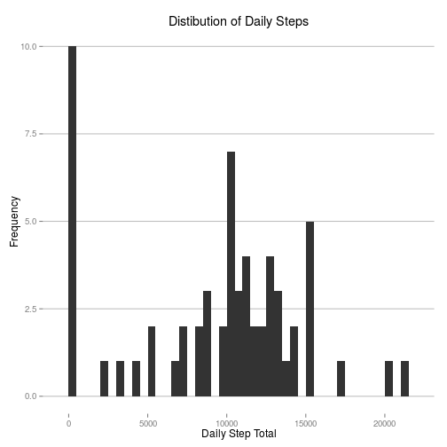
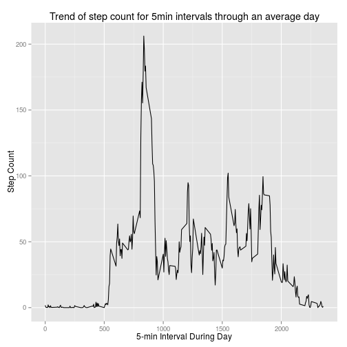
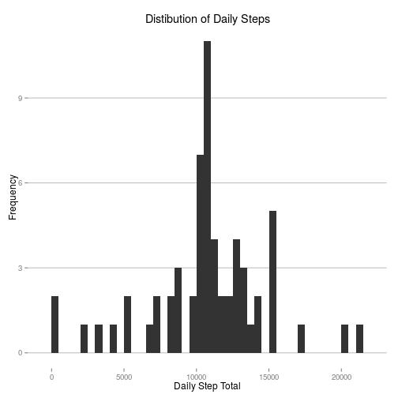
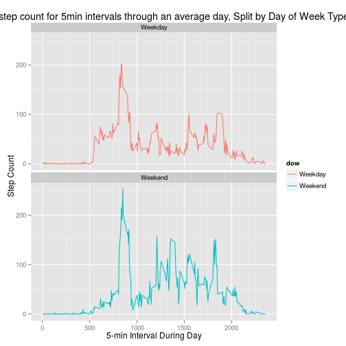

## Loading and preprocessing the data


```r
require(dplyr)
require(ggplot2)
require(ggthemes)
require(lubridate)

dat <- read.csv('activity.csv')
dat$date <- as.Date(dat$date)
```


## What is mean total number of steps taken per day?

There are a mean of 9354.2 steps taken each day

```r
dat %>% group_by(date) %>% 
  summarise(dailysteps = sum(steps, na.rm=T)) %>% 
  ggplot(aes(dailysteps)) + geom_histogram(binwidth = 500) + 
  theme_hc() + scale_colour_hc() +
  ggtitle('Distibution of Daily Steps') + xlab('Daily Step Total') + ylab('Frequency')
```

 

```r
dat %>% group_by(date) %>% 
  summarise(dailysteps = sum(steps, na.rm=T)) %>% 
  summarise(mean = mean(dailysteps, na.rm=T),
            median = median(dailysteps, na.rm=T))
```

```
## Source: local data frame [1 x 2]
## 
##      mean median
## 1 9354.23  10395
```


## What is the average daily activity pattern?

Below is a plot of the average daily pattern across 61 days.  The 5-min interval labelled 


```r
dat %>% group_by(interval) %>% summarise(avgSteps = mean(steps, na.rm=T)) %>% 
  ggplot(aes(interval, avgSteps)) + geom_line() + ggtitle('Trend of step count for 5min intervals through an average day') + 
  xlab('5-min Interval During Day') + ylab('Step Count')
```

 

The 5-min interval labelled 835 has the highest step count during the average day.


```r
dat %>% group_by(interval) %>% summarise(avgSteps = mean(steps, na.rm=T)) %>% arrange(desc(avgSteps)) %>% top_n(1)
```

```
## Selecting by avgSteps
```

```
## Source: local data frame [1 x 2]
## 
##   interval avgSteps
## 1      835 206.1698
```


## Imputing missing values

There are 2304 rows with missing data in the dataset.  The missing data was imputed by using the average interval step count.  As a result the mean and median step count by day has increased, and are now identical.


```r
dat_imp <- dat
nas <- is.na(dat_imp$steps)
avg_interval <- tapply(dat_imp$steps, dat_imp$interval, mean, na.rm=TRUE, simplify=TRUE)
dat_imp$steps[nas] <- avg_interval[as.character(dat_imp$interval[nas])]


dat_imp %>% group_by(date) %>% 
  summarise(dailysteps = sum(steps, na.rm=T)) %>% 
  ggplot(aes(dailysteps)) + geom_histogram(binwidth = 500) + 
  theme_hc() + scale_colour_hc() +
  ggtitle('Distibution of Daily Steps') + xlab('Daily Step Total') + ylab('Frequency')
```

 

```r
dat_imp %>% group_by(date) %>% 
  summarise(dailysteps = sum(steps, na.rm=T)) %>% 
  summarise(mean = mean(dailysteps, na.rm=T),
            median = median(dailysteps, na.rm=T))
```

```
## Source: local data frame [1 x 2]
## 
##       mean   median
## 1 10766.19 10766.19
```


## Are there differences in activity patterns between weekdays and weekends?


```r
dat_imp$dow <- ifelse(wday(dat_imp[,'date']) %in% c(6, 7),'Weekend', 'Weekday')
dat_imp$dow <- as.factor(dat_imp$dow)

dat_imp %>% group_by(interval, dow) %>% summarise(avgSteps = mean(steps, na.rm=T)) %>% 
  ggplot(aes(x=interval, y=avgSteps, color = dow)) +
  geom_line() +
  facet_wrap(~ dow, ncol = 1, nrow=2) +
  ggtitle('Trend of step count for 5min intervals through an average day, Split by Day of Week Type') + 
  xlab('5-min Interval During Day') + ylab('Step Count') 
```

 


